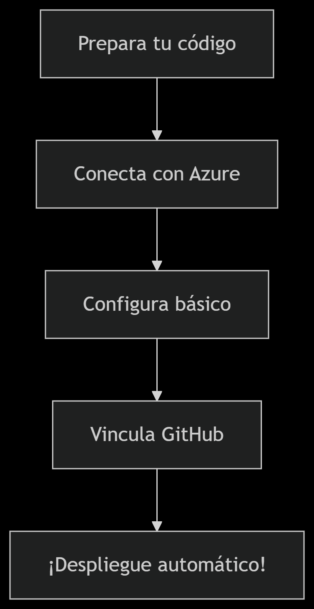

# 🎮✨ Despliega tu Pokédex Angular como un Maestro Pokémon



## 🌟 **¡Transforma tu código en una aventura en la nube!**

## 🛠 **Prepara tu Pokéball Digital** (Requisitos)diagrama_dezpliegue.png
- ✅ Angular CLI instalado (`ng version`)
- ✅ Repositorio en GitHub (¡tu PC ya es tu Centro Pokémon!)
- ✅ Cuenta Azure (tu mochila de herramientas)

## 🔥 **4 Pasos para la Evolución de tu App**

### 1️⃣ **Entra al Gimnasio Azure**
[](https://portal.azure.com)

1. Busca el **"Static Web Apps"** (tu nueva Pokéball)
2. Haz clic en **"Crear"** (¡Tu aventura comienza!)


### 2️⃣ **Conecta tu Pokédex con GitHub**
[](https://github.com)

1. **Autoriza** a Azure en GitHub
2. Selecciona:
   - Tu **Repositorio** (tu Pokédex personal)
   - Rama **main/master** (tu equipo principal)
3. Configura las rutas mágicas:
   ```json
   {
     "appLocation": "/",
     "outputLocation": "dist/pokedex"
   }
   ```

### 34️⃣ **¡Lanza tu Pokéball!**
1. **Revisa** tu configuración
2. Haz clic en **"Crear"** (¡Gotta deploy 'em all!)

## 🎉 **¡Felicidades, Entrenador!**
Tu Pokédex ahora vive en:  
🔗 `https://pokedex-[tu-alias].azurestaticapps.net`

[](https://white-beach-03e50fd0f.6.azurestaticapps.net/)

## 💡 **Consejos de un Entrenador Experto**
- ⏳ El primer despliegue es como evolucionar un Pokémon... ¡paciencia!
- 🔄 Cada `git push` es como usar un MT - ¡actualiza automáticamente!
- 📊 Monitorea tu app en "Insights" (tu Pokédex analítico)

[📚 Documentación Oficial](https://docs.microsoft.com) | [💬 Soporte Técnico](https://azure.microsoft.com/support)

